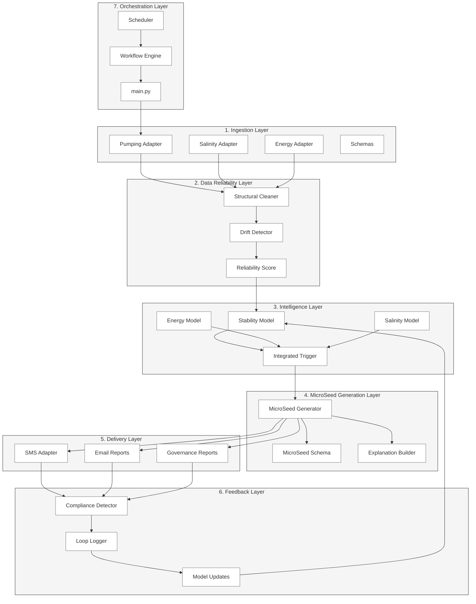

# 🌱 MicroSeeds Intelligence Engine
**Environmental Stability • Behavioral Coordination • District-Grade Intelligence**

MicroSeeds is a lightweight, composable intelligence engine that transforms noisy agricultural signals into simple, profitable, stability‑increasing actions delivered directly to farmers and districts.

It is the first step toward a **planetary environmental operating system**.

---

# 🚀 What MicroSeeds Does

MicroSeeds runs a complete intelligence loop:

1. **Ingests** pumping logs and environmental signals
2. **Cleans** and stabilizes noisy real‑world data
3. **Analyzes** energy, salinity, and extraction patterns
4. **Triggers** when a stability or profitability opportunity appears
5. **Generates** a MicroSeed — a tiny, actionable instruction
6. **Delivers** it via SMS to farmers
7. **Logs feedback** and updates the stability model

This loop is the foundation for district‑level coordination, energy savings, salinity protection, and long‑term agricultural stability.

---

# 🌍 Why MicroSeeds Matters

Agriculture in water‑stressed, export‑driven regions faces three systemic risks:

- **Energy volatility**
- **Salinity concentration**
- **Extraction instability**

MicroSeeds addresses all three by coordinating irrigation timing across farms using simple, SMS‑delivered actions.

Farmers get:
- Lower energy costs
- Clear timing windows
- Better crop stability

Districts get:
- Higher extraction stability
- Salinity‑risk reduction
- A weekly Stability Score

Governments get:
- Climate‑risk mitigation
- Energy‑demand smoothing
- A governance‑grade reporting layer

---

# 🧠 Architecture Overview

MicroSeeds is built on a clean, 7‑layer architecture:

```
MicroSeeds/
  ingestion/        # Bring in pumping, salinity, energy data
  reliability/      # Clean, validate, score, detect drift
  intelligence/     # Stability model + integrated trigger
  microseeds/       # MicroSeed schema + generator + explanations
  delivery/         # SMS + email + reporting
  feedback/         # Compliance + loop logging
  orchestration/    # Scheduler + workflow engine
  tests/            # Walking skeleton tests
```

Each layer is modular, testable, and ready for district‑scale deployment.

## 🌐 Architecture Diagram



### ⭐ What This Diagram Shows

1. **The full data path** — Raw → cleaned → reliable → modeled → triggered → MicroSeed → delivered → feedback → learning.

2. **The intelligence loop** — The system is not linear — it's a closed loop:
   - Feedback updates the model
   - The model improves MicroSeeds
   - MicroSeeds improve stability
   - Stability improves district outcomes

3. **The composable architecture** — Each layer is independent and testable.

4. **The operational heartbeat** — The orchestration layer drives the entire system.

---

# 🏗️ MVP Status

This repository currently includes:

- A **walking skeleton** that runs end‑to‑end
- A **sample pumping log**
- A **simple stability decision rule**
- A **MicroSeed generator**
- A **console-based SMS delivery adapter**
- A **feedback logger**
- A **CI pipeline** (GitHub Actions)
- A **clean repo structure** ready for expansion

The system runs in seconds and demonstrates the full intelligence loop.

---

# ▶️ Running the MVP

### **1. Clone the repo**

```bash
git clone https://github.com/doctorfixes/MicroSeeds3.git
cd MicroSeeds3
```

### **2. Install dependencies**

```bash
pip install -r requirements.txt
```

### **3. Run the engine**

```bash
python main.py
```

You will see:

- Input ingestion
- Data cleaning
- Decision logic
- Trigger evaluation
- MicroSeed generation
- SMS-style output
- Feedback logging

---

# 🧪 Tests

Run the walking skeleton test:

```bash
pytest -q
```

This ensures the intelligence loop runs without errors.

---

# 🧱 Directory Structure

```
MicroSeeds/
  main.py
  config.py
  ingestion/
  reliability/
  intelligence/
  microseeds/
  delivery/
  feedback/
  orchestration/
  tests/
```

Each directory contains minimal, composable modules that can be extended without refactoring.

---

# 🤝 Contributing

MicroSeeds uses a **layered, composable architecture**.
Contributions should:

- Add new modules inside the correct layer
- Maintain clean separation of concerns
- Include a test for every new behavior
- Avoid coupling between layers

Pull requests are welcome.

---

# 📈 Roadmap

### **V0.2**
- Real compliance detection
- Drift detection
- Reliability scoring

### **V0.3**
- District email reports
- Multi-block ingestion
- Early salinity modeling

### **V1.0**
- Full district deployment
- Stability Score (33/33/33)
- SMS gateway integration
- Seasonal governance reporting

---

# 🌐 Vision

MicroSeeds is the first step toward a **planetary environmental intelligence OS** —
a system that stabilizes extraction, protects profitability, and coordinates behavior across entire agricultural regions.

This repository is the foundation.